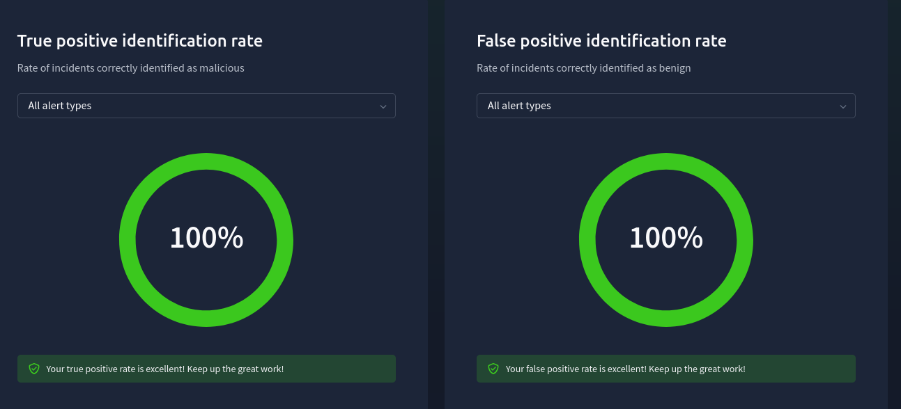

# 🛡️ SOC Simulator - Phishing Alert Investigation (TryHackMe)

This project documents a hands-on cybersecurity alert triage and incident response simulation using the [SOC Simulator](https://tryhackme.com/soc-sim) from TryHackMe. The goal was to detect, analyze, and classify **phishing alerts** as either True Positives or False Positives, with detailed case reporting and remediation recommendations.

---

## 🎯 Objectives

- Monitor and analyze real-time phishing alerts.
- Identify critical events such as suspicious emails and URLs.
- Classify alerts as True Positive (TP) or False Positive (FP).
- Document full case reports with recommendations.

---

## 🖼️ Alert Classifications with Screenshots

### ✅ True Positive Example: Suspicious Microsoft Login
- **Reason for Classifying as True Positive:**
  > The sender domain (m1crosoftsupport.co) was a lookalike of Microsoft's domain. The email content matched phishing patterns with a malicious login URL and a suspicious sign-in from Nigeria.

- **Reason for Escalation:**
  > The alert involved credential theft attempts targeting a user with spoofed Microsoft branding and a malicious phishing URL.

- **Remediation Actions:**
  - Block the domain `m1crosoftsupport.co`.
  - Invalidate user session and reset credentials.
  - Alert user and initiate awareness training.

- **Indicators of Attack:**
  - Domain: `m1crosoftsupport.co`
  - IP: `102.89.222.143`
  - URL: `https://m1crosoftsupport.co/login`
  - Subject: “Unusual Sign-In Activity”

📷 Screenshot:  

---

### ❌ False Positive Example: HR Onboarding Email

- **Reason for Classifying as False Positive:**
  > The sender domain was verified (`hrconnex.thm`) and content matched standard HR onboarding. No malicious indicators were found.

- **Why Not Escalated:**
  > Internal communication confirmed sender legitimacy; no links were flagged as malicious.

- **No Remediation Required.**

- **Indicators Observed (but safe):**
  - Domain: `hrconnex.thm`
  - Subject: “Action Required: Finalize Your Onboarding Profile”

📷 Screenshot:  

---

## 📊 Final Results

| Metric                  | Value     |
|-------------------------|-----------|
| True Positive Rate      | 100%      |
| False Positive Rate     | 100%      |
| Closed Alerts           | 5         |
| Mean Time to Resolve    | 2 minutes |
| Mean Dwell Time         | 9 minutes |

📷 Pie Charts:  

---

## 🧠 Key Skills Practiced

- Email threat triage  
- SOC alert classification  
- Report writing & escalation decision-making  
- Phishing indicator analysis  

---

## 🧩 Platform

> Simulation conducted on [TryHackMe - SOC Simulator](https://tryhackme.com/soc-sim)

---

## 📂 Screenshots Gallery

All screenshots are stored in the `screenshots/` folder.

---

## 📌 Author

**Jenish Patel**  
Cybersecurity Learner | SOC Analyst Aspirant  

---

